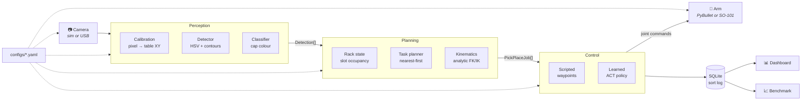

# 🧪 SampleSort

**A vision-guided robotic arm that autonomously sorts lab sample tubes, using
computer vision, inverse kinematics and imitation learning (ACT via LeRobot).
Runs fully in PyBullet simulation, with SO-101 hardware support.**

A camera watches a tabletop of sample tubes. SampleSort detects each one,
classifies it by cap colour, decides which rack slot it belongs in, and commands
a 5-DOF arm to pick it up and put it there. Every sort is written to a SQLite
chain-of-custody log.

Everything runs headless with no hardware and no GPU, so you can clone this and
watch it sort in about two minutes.

<!-- ============================================================= -->
<!-- TODO: DEMO GIF PLACEHOLDER                                    -->
<!-- Record with: samplesort sim-demo --gui --seed 42 --num-tubes 8 -->
<!-- Then drop the GIF at docs/demo.gif and uncomment:             -->
<!--  -->
<!-- ============================================================= -->

> **📽️ Demo GIF goes here** — see the comment above for how to record it.

---

## What it does

| | |
| --- | --- |
| **Perceive** | Overhead camera → HSV cap detection → contour filtering → table-plane coordinates, with explicit parallax correction |
| **Decide** | Class → destination rack, next free slot, jobs ordered nearest-first |
| **Act** | Analytic IK → six-stage pick-and-place, or a trained ACT policy in closed loop |
| **Record** | Every attempt logged to SQLite: class, pickup position, rack, slot, mode, success, duration, failure reason |
| **Measure** | Seeded benchmark producing JSON + Markdown, and a Streamlit dashboard |

Two manipulation modes share one interface:

- **Scripted** — camera-to-table calibration plus analytic inverse kinematics.
  The reliable baseline. **100%** on 120 tubes.
- **Learned** — an ACT (Action Chunking Transformer) policy trained on
  demonstrations via Hugging Face LeRobot. The full record → train → evaluate
  pipeline is runnable end to end.

---

## Quickstart (simulation)

```bash
git clone https://github.com/vignxhhh/samplesort.git
cd samplesort

python -m venv .venv && source .venv/bin/activate
pip install -e .

# Sort eight randomised tubes into their racks
samplesort sim-demo --seed 42 --num-tubes 8
```

```
Spawned 8 tubes (seed 42):
  yellow  at (+0.215, -0.020) -> rack_c
  blue    at (+0.211, +0.100) -> rack_b
  ...

run e8d7ecc5edc3 (scripted)
  iterations        : 2
  detections seen   : 8
  jobs attempted    : 8
  jobs succeeded    : 8 (100%)
  mean time per job : 0.52 s
  rack occupancy    : {'rack_a': '2/4', 'rack_b': '2/4', 'rack_c': '4/4'}
  sort log          : outputs/sortlog.db
```

Then explore:

```bash
samplesort run --mode scripted --dry-run   # perceive and plan, no motion
samplesort benchmark --trials 20           # metrics JSON + Markdown table
samplesort dashboard                       # Streamlit view of the sort log
samplesort sim-demo --gui                  # watch it in the PyBullet window
```

The learning pipeline (needs the optional extra):

```bash
pip install -e ".[learning]"

samplesort record --episodes 20 --num-tubes 3   # scripted demos → LeRobot dataset
samplesort train --steps 2000                   # train ACT
samplesort evaluate --episodes 10               # roll out and score
samplesort run --mode learned --policy checkpoints/act/
```

Every command has `--help`.

---

## Architecture



The rule that holds this together: **nothing above the hardware abstraction layer
imports a concrete backend.** `build_backend()` is the only place that decides
between simulation and hardware, so the pipeline, the controllers and the
perception stack are all backend-agnostic.

Full diagrams, the layer contract and fifteen recorded design decisions are in
**[docs/architecture.md](docs/architecture.md)**.

---

## Benchmark results

20 seeded trials × 6 tubes = **120 tubes**, scripted mode,
headless CPU. Real output from `samplesort benchmark --trials 20`.

| Metric | Result |
| --- | ---: |
| Sorting accuracy (correct rack) | **100.0%** |
| Grasp success rate | **100.0%** |
| Completion rate | **100.0%** |
| Mean time per sample | **0.39 s** ± 0.04 |
| Failures | none |

Simulated perception is ~1 mm accurate against an 18 mm grasp tolerance, so the
scripted baseline saturates. To measure something falsifiable, the benchmark can
inject localisation error:

| Localisation noise (σ) | Sorting accuracy | Grasp success | Completion |
| ---: | ---: | ---: | ---: |
| 0 mm | 100.0% | 100.0% | 100.0% |
| 5 mm | 100.0% | 100.0% | 100.0% |
| 10 mm | 100.0% | 73.9% | 83.3% |
| 15 mm | 100.0% | 50.0% | 66.7% |
| 20 mm | 87.5% | 33.3% | 53.3% |

The system is robust to 5 mm of error and degrades past 10 mm, where noise starts
consuming the grasp tolerance. Sorting accuracy holds at 100% until 20 mm because
position noise does not affect *classification* — the grasp breaks first, not the
decision. In practice: keep your calibration residual under ~5 mm.

Full tables, method and environment: **[docs/results.md](docs/results.md)**.

---

## Real hardware

SampleSort targets the open-source **SO-101** arm (Feetech STS3215 serial-bus
servos) with a USB overhead camera and a printed ArUco calibration board.

```bash
samplesort calibrate --generate-board     # print the ArUco target at 100% scale
samplesort calibrate                      # fit the pixel → table homography
samplesort run --mode scripted --dry-run  # perceive and plan, no motion
```

> ⚠️ The hardware path is implemented and tested against LeRobot 0.4.4's real
> `FeetechMotorsBus` API, with 31 tests covering the conversion, limit-enforcement
> and error paths against fakes — but it has **not been validated on a physical
> arm**. Follow the bring-up procedure carefully.

Bill of materials, workspace geometry, servo calibration, the kinematic-zero
alignment procedure, lighting advice, safety notes and a troubleshooting table:
**[docs/hardware_setup.md](docs/hardware_setup.md)**.

---

## Project structure

```
samplesort/
├── configs/                  # every hardware and workspace value lives here
│   ├── default.yaml          #   mode, seed, pipeline and learning settings
│   ├── arm_so101.yaml        #   link lengths, joint limits, servo wiring
│   ├── camera.yaml           #   resolution, mounting pose, intrinsics path
│   ├── workspace.yaml        #   pickup zone, tube geometry, rack slots, board
│   └── classes.yaml          #   cap colours → HSV ranges → destination racks
├── samplesort/
│   ├── config.py             # Pydantic models, cross-file validation
│   ├── cli.py                # Typer entry point (8 commands)
│   ├── hal/                  # abstract arm/camera + sim and real backends
│   ├── sim/                  # PyBullet scene and the generated arm URDF
│   ├── perception/           # calibration, detector, classifier, types
│   ├── planning/             # kinematics, rack state, task planner
│   ├── control/              # scripted, learned, trajectory
│   ├── learning/             # record, train, evaluate (LeRobot ACT)
│   ├── logging_db/           # SQLite sort log
│   ├── pipeline.py           # the perceive → plan → execute → log loop
│   └── benchmark.py          # seeded trials → JSON + Markdown
├── dashboard/app.py          # Streamlit view of the sort log
├── scripts/                  # ArUco board generator, camera calibration
├── tests/                    # 291 tests, all headless
└── docs/                     # architecture, hardware setup, results
```

## Development

```bash
pip install -e ".[dev,learning]"

ruff check .            # lint
ruff format --check .   # formatting
mypy samplesort/        # type check (strict: no untyped defs)
pytest -q               # 291 tests, headless, no GPU
```

CI runs exactly these four steps on Python 3.10 and 3.11, plus a CLI smoke test.

Useful markers:

```bash
pytest -m "not slow"      # skip the long simulation runs
pytest -m "not learning"  # skip anything needing torch/LeRobot
```

---

## Roadmap

Stretch goals from the specification, none of which are required for the core
system to work:

- [ ] **QR / barcode sample IDs in the log.** The reader
      (`perception/classifier.py:QRReader`) and the `sample_id` column both exist
      and are tested; set `qr_enabled: true` in `classes.yaml` and print codes on
      the tubes.
- [ ] **Recovery behaviours for dropped or knocked-over tubes.**
      `SimWorld.tube_is_upright()` already detects the condition; what is missing
      is a righting manoeuvre.
- [ ] **Wrist camera for grasp verification.** Would replace the
      `has_object()` protocol's optimistic assumption on real hardware.
- [ ] **Edge deployment.** Run perception on a Jetson and report inference latency.
- [ ] **Learned detector.** Swap the HSV thresholds for a small trained object
      detector and compare accuracy under varying lighting.

Beyond the spec, the honest next step is **validating the hardware path on a
physical SO-101** — see the "not yet validated" section of
[docs/results.md](docs/results.md).

---

## License

MIT — see [LICENSE](LICENSE).
