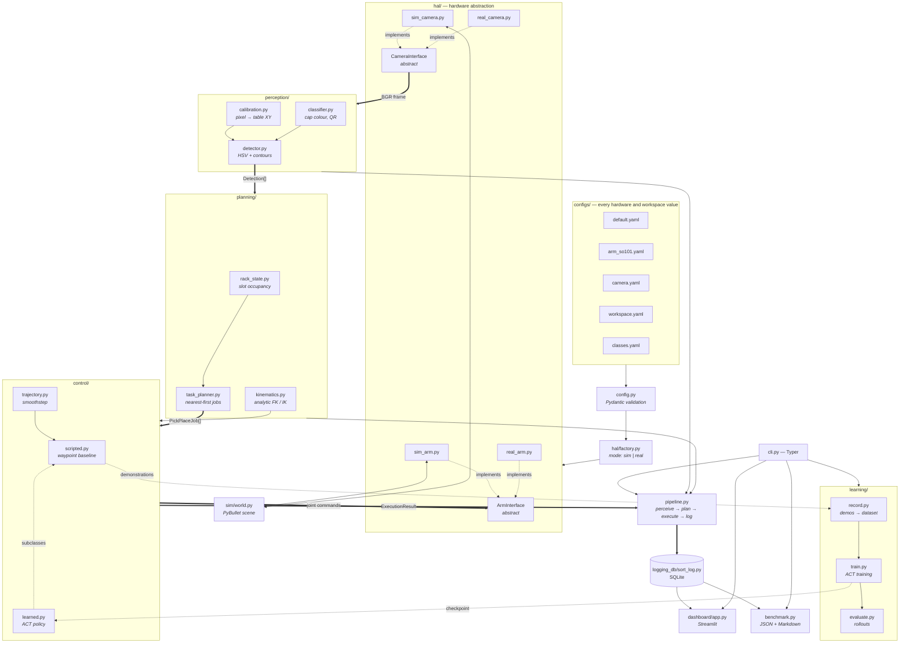
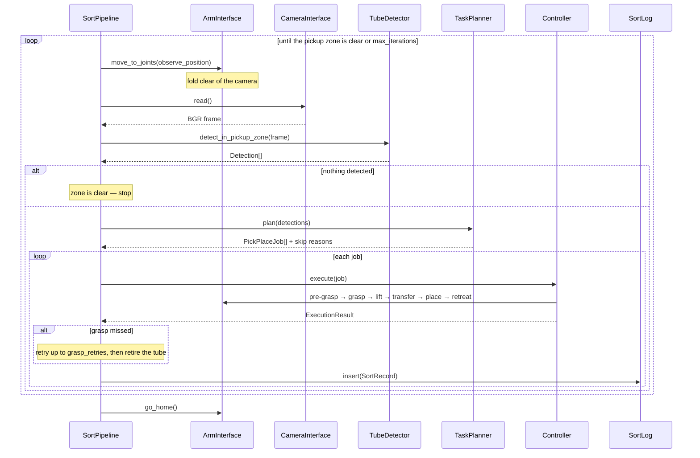

# SampleSort Architecture

## System overview

## The sort loop

## Layer contract

| Layer | Knows about | Never touches |
| --- | --- | --- |
| `config` | YAML files | Anything else |
| `hal` | Config, PyBullet or serial/OpenCV | Perception, planning, control |
| `perception` | Config, frames, calibration | The arm, the planner, PyBullet |
| `planning` | Config, detections, rack state | Frames, the arm, the simulator |
| `control` | Config, jobs, `ArmInterface` | Which backend it is driving |
| `pipeline` | All of the above | Which backend it is driving |
| `benchmark`, `dashboard` | Pipeline, sort log | Hardware |

The rule that makes this work: **nothing above `hal/` imports a concrete
backend.** `build_backend()` is the only place that decides between sim and real.
`SortPipeline`, `ScriptedController` and `TubeDetector` are all backend-agnostic,
which is why the same end-to-end test covers both paths' logic.

---

## Design Decisions

### D1 — Arm geometry is generated from config, not hard-coded

The analytic kinematics and the PyBullet URDF are both derived from
`configs/arm_so101.yaml`. This makes it impossible for the simulated arm and the
kinematic model to disagree, and satisfies the "no hard-coded hardware values"
standard from section 7 of the spec.

### D2 — The learning stack is an optional extra

`torch` and `lerobot` are declared under the `learning` extra rather than as core
dependencies. The sim, perception, planning, pipeline, benchmark and dashboard
paths all install and run without them, which keeps `pip install -e .` light and
keeps CI fast.

### D3 — Inverse kinematics is analytic, not numerical

The spec permits numerical IK. But this arm — base yaw, three coplanar pitch
joints, tool roll — has an exact closed form. The analytic solver is faster, has
no convergence failures, exposes both elbow branches explicitly so joint limits
can pick between them, and distinguishes "outside the workspace" from "reachable
but illegal". It round-trips against forward kinematics to **3 × 10⁻¹⁶ m**.

### D4 — Grasping in simulation is constraint-based

`SimArm.close_gripper()` attaches a fixed constraint when a tube's cap is inside
the configured tolerance box around the tool centre point, rather than relying on
friction between finger and cylinder. Friction grasps on an 8 mm cylinder are
numerically fragile in PyBullet; benchmark numbers would measure solver noise
instead of controller quality. Positioning error still produces genuine failures
— the tolerance is what the noise sweep in `docs/results.md` measures — and
results stay reproducible for a given seed.

### D5 — Tube placement uses a jittered grid, not rejection sampling

Rejection sampling could not reliably fit 8 tubes into the pickup zone. The grid
splits the zone into cells at least `min_separation` wide and jitters within each
cell by at most half the slack, so the separation guarantee is structural and
placement never fails below the zone's stated capacity.

### D6 — Parallax is corrected explicitly

The homography is fitted on the table plane, because that is where a printed
ArUco board lies. Tube caps sit 52 mm above it, which produced 4–10 mm of
localisation error. `Calibration` carries the camera height and optical nadir and
scales a detection back towards the nadir by `(H − h) / H`. Measured error fell
from ~10 mm to ~0.01 mm in simulation, and the same correction applies unchanged
on real hardware.

### D7 — Hue is scored by centrality, saturation and value by headroom

Hue drifting either way means the colour is becoming a different class, so
centrality is right. But the upper bounds on saturation and value are don't-care
ceilings: a fully saturated, brightly lit cap is the *best* case and must not be
penalised for sitting at the top of its range. Scoring those two by headroom
above the lower threshold raised pure red from 0.5 to 1.0.

Separately, `classes.yaml` has to express red as two intervals because a range
cannot be written inverted. Those are merged into a single `[172, 188]` interval
evaluated modulo 180 before scoring, so pure red lands at the centre where it
belongs.

### D8 — The learned controller subclasses the scripted one

Waypoint planning, feasibility checking, grasp sensing and placement verification
are identical between the two modes; only `execute()` differs. Subclassing means
the pipeline, the benchmark and the CLI accept either with no branching, and both
modes are scored by exactly the same rules — which is what makes the
scripted-vs-learned comparison column meaningful rather than an apples-to-oranges
table.

### D9 — Simulation ground truth is attached explicitly, and only in simulation

`SortPipeline.plan()` links each job to the PyBullet body it refers to. This is
instrumentation: it drives grasp and placement verification, and it lets the
benchmark score whether a tube reached the rack its *true* class belongs in —
catching misclassification, which a grasp-success number cannot. Perception and
planning never read it, and on real hardware it is simply absent.

### D10 — The benchmark can inject localisation noise

Simulated perception is ~1 mm accurate against an 18 mm grasp tolerance, so
without injected error the scripted baseline reported 100% on every metric and
the benchmark carried no information. `--perception-noise` turns it into a
sensitivity measurement and exercises the whole failure-reporting path. The
default is 0.0, so headline numbers stay honest.

### D11 — Demonstration datasets store PNG frames

`use_videos=False` avoids an ffmpeg/codec dependency that would break CI and
offline machines. These datasets are small enough that the size difference does
not matter.

### D12 — Hugging Face libraries are forced offline

LeRobot resolves a dataset's `repo_id` against the Hub even for a purely local
dataset, which fails on an air-gapped machine and in CI. `_deps._force_offline()`
sets `HF_HUB_OFFLINE` and friends, but only via `setdefault`, so anyone who wants
Hub access can still opt in. Relatedly, ACT's `pretrained_backbone_weights`
default downloads ImageNet weights on first use; SampleSort sets it to `None`.

### D13 — The ArUco board's table orientation is a stated convention

The overhead camera is mounted so that table +X points up the image and +Y points
left, matching `camera.yaml`'s `up_axis`. The board generator and the solver share
`board_corner_table_positions`, so they cannot disagree; a board laid down rotated
fails loudly with a large residual rather than silently producing a rotated frame.

### D14 — The sort log is append-only

Nothing updates or deletes a row in normal operation. That is the right shape for
a chain-of-custody record, and it removes any need for schema migrations. A
`run_id` groups the rows from one pipeline or benchmark run, which is what makes
per-run and scripted-vs-learned queries possible from the log alone.

### D15 — Tube and clearance geometry was corrected, not tuned around

With 50 mm tubes, a carried tube hung 57 mm below the tool centre point and its
base passed *below* the tops of tubes still standing on the table, knocking them
over in transit — two grasp misses per 8-tube run. Rather than raise the grasp
tolerance to mask it, the geometry was fixed: 40 + 12 mm tubes, 46 mm grasp
height, 70 mm approach clearance, giving 18 mm of clearance over a standing tube.
